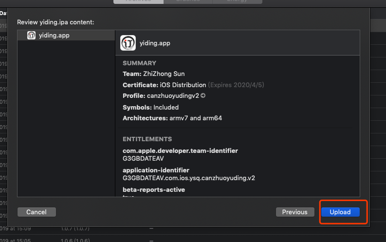

# 打包步骤

1. 从苹果开发者中心下载到本地安装到钥匙串

3. 安装cordova 6.x版本

   ```bash
   npm i cordova@6.x -g
   ```
   
   
   
3. 创建cordova项目

   ```bash
   cordova create yiding com.ios.ysq.canzhuoyuding.v2 易订V2
   ```

   

4. 打开xcode的项目资源目录复制images下文件

   

   

5. 修改scheme为release

   

6. 模拟器选择Generic IOS Device类型

   

7. 选择签名配置文件

   

8. 归档打包

   

   

   
   

   


   

   

9. 登录开发者中心配置发布信息链接地址`https://appstoreconnect.apple.com/WebObjects/iTunesConnect.woa/ra/ng/app/1459607695`

   

10. 添加需要构建的之前上.-user-images/image-20190531110438678.png)

11. 构建版本添加完成存储提交审核.